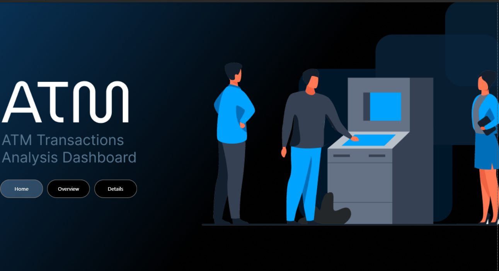
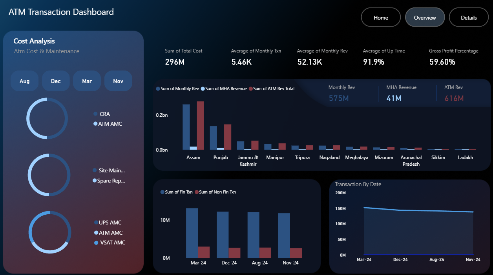
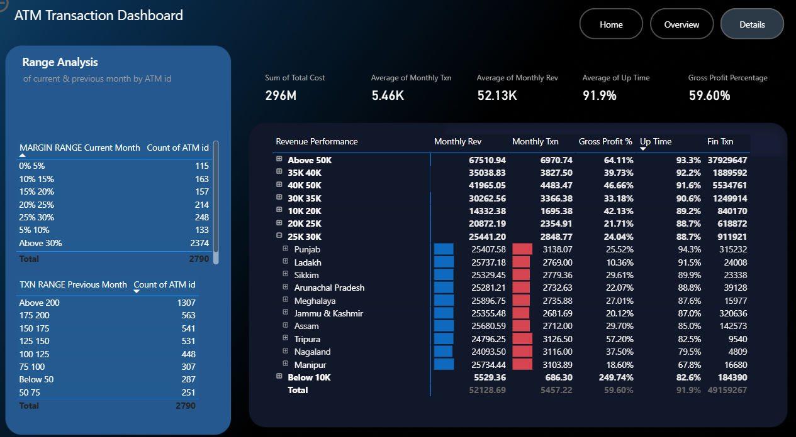

# ATM_Transaction_Dashboard
ATM Transaction Dashboard  created by using  PowerBI

## 📌 Key Features

- **Revenue Performance** by monthly transaction and region
- **Gross Profit %** and **Uptime** comparison
- **ATM Cost & Maintenance** breakdown (CRA, AMC, UPS, etc.)
- **Range-based Analysis** on Margins and Transactions
- **Filters & Drilldowns** for deep-dive analysis

## 📊 Dashboard Preview

### Home View

### Overview View

### Details View

